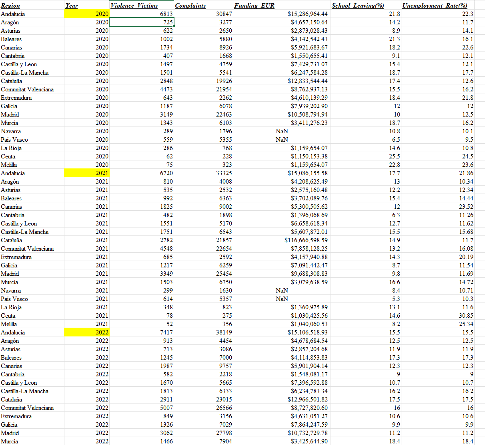
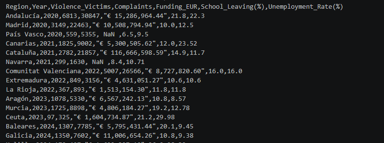
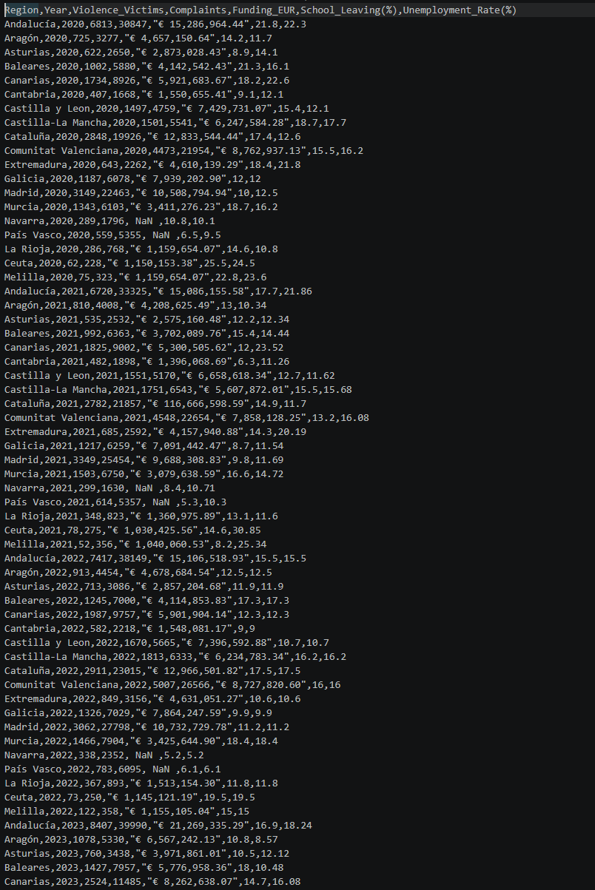

## Body

The dataset includes annual regional statistics of gender violence in Spain from 2020 to 2024, covering 19 autonomous regions and municipalities.

Main data file: Gender Violence Spain Dataset (2020–2024).csv: complete data, covering 19 regions, 5 years, totaling 95 rows
Example file: sample.csv: a simplified sample of 15 rows for quick data format inspection

Field names ----- Data types ----- Field explanations
Region ----- Text ----- Name of the Spanish autonomous region or municipality
Year ----- Integer ----- Year of the statistical year (2020-2024)
Violence_Victims ----- Integer ----- Number of victims registered in gender violence
Complaints ----- Integer ----- Number of formal complaints filed
Funding_EUR ----- Text ----- Government special funding in euros
School_Leaving(%) ----- Floating ----- Early school leaving rate (%)
Unemployment_Rate(%) ----- Floating ----- Unemployment rate (%)

## Images

Here is a pay link on Stripe ( https://buy.stripe.com/3cs8yP7sY87d0vu9AB ). Please contact me lonlonago@foxmail.com after funding $89, and I will send you a complete data files , thank you!

